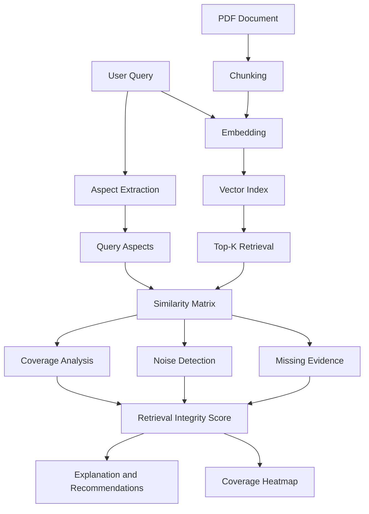

# Retrieval Integrity Auditor for RAG Systems

Auditing the **retrieval step** of Retrieval-Augmented Generation (RAG) systems
(Aligned with **Track 3**: *Auditing the RETRIEVAL step, not generation*)

---

## Overview

Large Language Model (LLM) failures are often caused **not by generation**, but by **poor retrieval**:

* Missing relevant documents
* Retrieving irrelevant or noisy chunks
* Partial coverage of user intent

This project implements a **Retrieval Integrity Auditor** that:

* Breaks user queries into semantic aspects
* Audits retrieved chunks for coverage, noise, and missing evidence
* Produces a quantitative **Retrieval Integrity Score**
* Explains *why* retrieval succeeded or failed

The system is **model-agnostic** and works with **any PDF-based knowledge base**.

---

## Key Features

* PDF ingestion and chunking
* Embedding-based semantic retrieval
* Query aspect extraction
* Aspect-level coverage analysis
* Noise and missing-evidence detection
* Retrieval Integrity Score (0–100)
* Visual heatmaps for aspect × chunk coverage
* Streamlit-based interactive UI

---

## Architecture Overview (Track 3)



---

## Project Structure

```text
retrieval_integrity_auditor/
│
├── app.py                     # Streamlit application
├── embeddings.py              # Embedding wrapper
├── requirements.txt
├── README.md
│
├── ingestion/
│   ├── loader.py              # PDF loader
│   ├── chunker.py             # Text chunking
│   ├── embedder.py            # Embedding generation
│   ├── index_builder.py       # Vector index creation
│
├── vector_store/
│   └── vector_db.py           # Vector search backend
│
├── core/
│   ├── aspect_extractor.py
│   ├── similarity.py
│   ├── coverage_analyzer.py
│   ├── noise_detector.py
│   ├── missing_evidence.py
│   └── scoring.py
│
├── explainability/
│   ├── explanations.py
│   └── recommendations.py
│
├── visualization/
│   ├── heatmap.py
│   └── score_meter.py
│
└── data/
    ├── chunks/
    ├── vector_index/
    └── retrieval_outputs/
```

---

## How the System Works

### 1. Document Ingestion

* User uploads a PDF
* Text is extracted page-wise
* Text is chunked into overlapping semantic chunks

### 2. Embedding & Indexing

* Each chunk is converted into a vector embedding
* Vectors are stored in a vector index

### 3. Query Understanding

* User query is decomposed into **semantic aspects**
* Example:

  * Definition
  * Types
  * Implications

### 4. Retrieval

* Top-K chunks are retrieved using semantic similarity
* A similarity matrix (aspect × chunk) is computed

### 5. Auditing (Track 3 Core)

For each aspect:

* **Coverage Analysis** – supported / partial / missing
* **Noise Detection** – irrelevant chunks
* **Missing Evidence Detection** – expected but not retrieved

### 6. Scoring & Explainability

* Coverage score
* Noise penalty
* Missing evidence penalty
* Final **Retrieval Integrity Score**
* Human-readable explanations & recommendations

---

## Example Output

* Retrieved chunks with similarity scores
* Aspect-wise coverage labels
* Noise chunk identification
* Missing evidence detection
* Heatmap visualization
* Integrity score gauge
* Actionable recommendations

---

## Installation

```bash
git clone https://github.com/<your-username>/retrieval_integrity_auditor.git
cd retrieval_integrity_auditor

python3 -m venv venv
source venv/bin/activate

pip install -r requirements.txt
```

---

## Running the Application

```bash
streamlit run app.py
```

Then open your browser at:

```
http://localhost:8501
```

---

## Intended Use Cases

* Debugging RAG pipelines
* Evaluating retriever quality
* Research on retrieval failures
* Dataset and chunking strategy validation
* Teaching RAG system internals

---

## Alignment with Track 3

This project **strictly audits retrieval**, not generation:

| Track 3 Requirement | Implemented |
| ------------------- | ----------- |
| Query decomposition | Yes         |
| Retrieval auditing  | Yes         |
| Coverage analysis   | Yes         |
| Noise detection     | Yes         |
| Missing evidence    | Yes         |
| Scoring             | Yes         |
| Explainability      | Yes         |

---

## Limitations & Future Work

* Faster indexing with FAISS / HNSW
* Caching embeddings across sessions
* Hybrid (keyword + vector) retrieval
* Multi-document knowledge bases
* Retriever benchmarking across models

---

